## Hackbio-Cancer-Internship

## programming in biology & Data visualization

## Authors(@slack):

Abdullah Ibrahim Ali(@Abdullah108)  
Mahmoud Hassanen (@Mahmoud203)  
Sarah Shebl (@Sarah50)  
Kareem Elsayed Saad Abdell Gawad(@Kareem\_101)

## Introduction

Evaluation of  products related to combating antimicrobial resistance (AMR). To do this it could concentrate on such areas as the drug development pipelines, latest clinical trials, form of antibiotics, and major pathogens that these new therapies are directing towards. It also might consider the state of innovation of AMR related technologies and products, barriers to the development and launch of new products and solutions, as well as mechanisms of resistance to the new products and their differential distribution across the regions


# AMR New Products Deep Analysis

<aside>
💡

Resource : from the WHO ( World Health Organization ) 

the Data of update : Nov-21

</aside>

The dataset is measure effect Different Drugs with different methods and measure different variables 

like : how drugs active against Priority Pathogen 

<aside>
💡

**Key insights :**

- **The dataset analyzes various drugs' effects on priority pathogens, focusing on antibiotics and non-traditional categories**
- **32 antibiotic products are included, with the majority in Phase I of R&D**
- **Non-traditional categories include bacteriophages, immunomodulating agents, microbe-modulating, miscellaneous, and antibodies**
- **Bacteriophages and phage-derived enzymes (9 products) show promise, with 5 out of 9 in Phase II**
- **Immunomodulating agents (2 products) demonstrate potential, particularly against priority pathogens**
- **Microbe-modulating products (9 in total) primarily target Clostridioides difficile**
- **Miscellaneous category (5 products) includes various antibacterial classes with diverse administration routes**
- **Antibodies (6 products) show promising effectiveness against all tested pathogens**
</aside>

# What is The Classification of the Products in the data set?

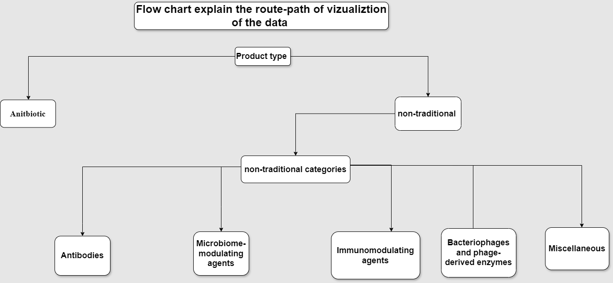

---

# Antibiotics:

the numbers of the antibiotics in the dataset is : **32 Product**

### **What is the antibacterial class of the antibiotics ?**

**there is +30 bacterial class for this antibiotics.**

### **the R.D phase of the Products :**

the vast majority of the Products is still in the Phase I 

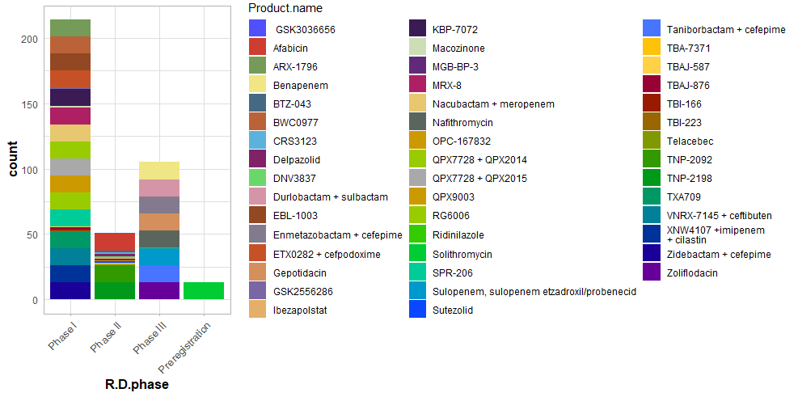

---

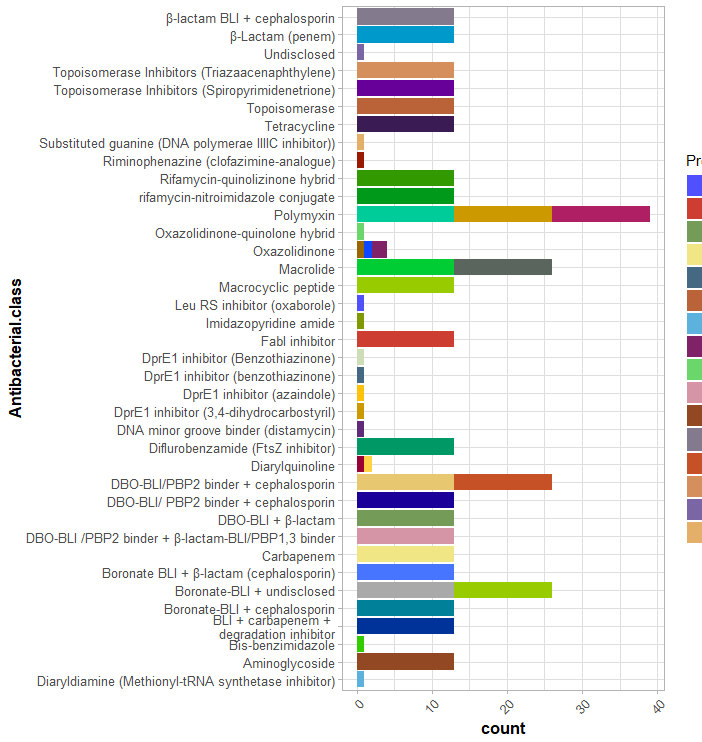

### **the Route of Administration of the different Products**

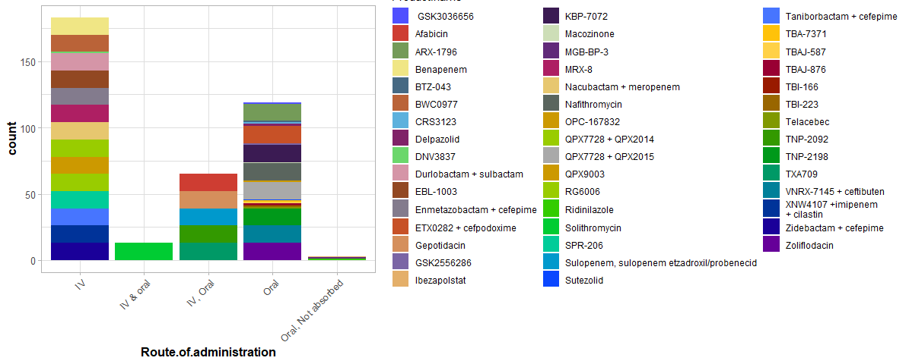

### The Results of the Products against Priority Pathogens

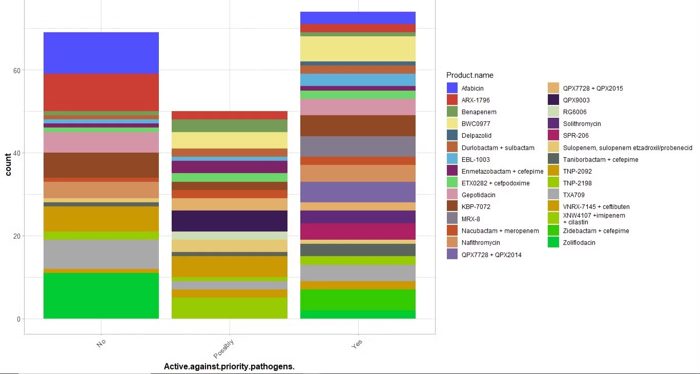

---

# **Non-Traditional Categories**

**the Non-Traditional Categories is divided into 5  :**

1. **Bacteriophages and phage-derived enzymes**
2. **Immunomodulating agents**
3. **microbe-modulating**
4. **Miscellaneous**
5. **antibodies data**

# Bacteriophages and phage-derived enzymes

the numbers of the **Bacteriophages and phage-derived enzymes type Drug** in the dataset is : 9 **Product**

### **What is the antibacterial class of the** Bacteriophages and phage-derived enzymes**?**

There is four Antibacterial class : 

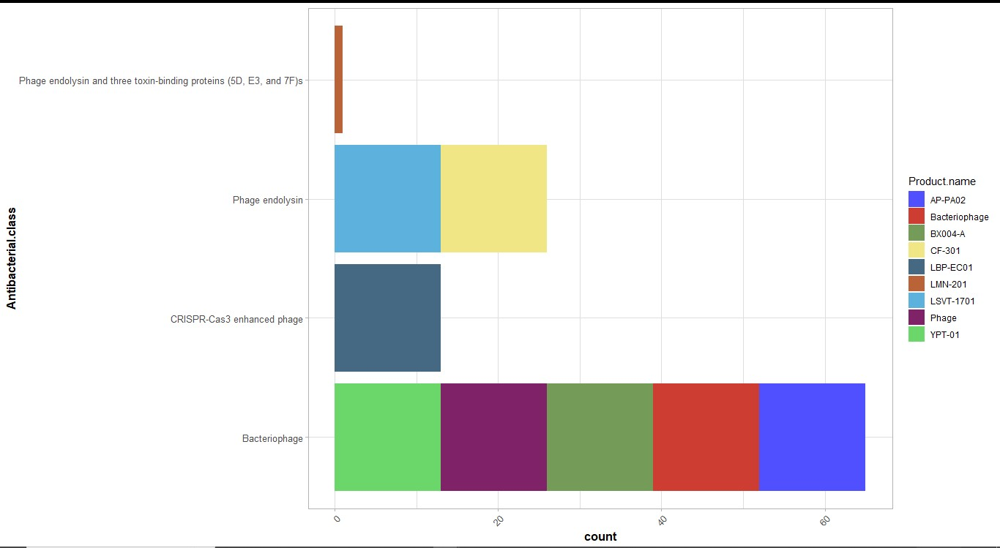

### **the R.D phases of The** Bacteriophages and phage-derived enzymes **Products :**

The 5 out of 9 of these product in the Phase II

### **the Route of Administration of the different Products**

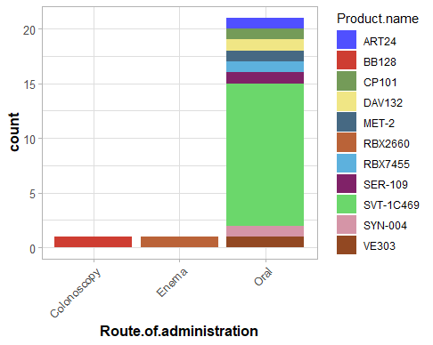

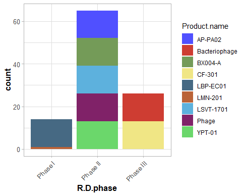

### **Result**

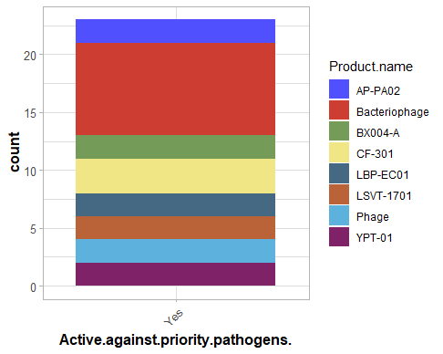

# **Immunomodulating agents :**

there is only 2 **Immunomodulating agents products** 

### **What is the antibacterial class of the Immunomodulating agents ?**

there is two (anti bacterial classes in the data) : 

- Antagonist of super-antigen exotoxins and CD28 T-cell
- Recombinant human plasma gelsolin protein

### **the Route of Administration of the different Products ?**

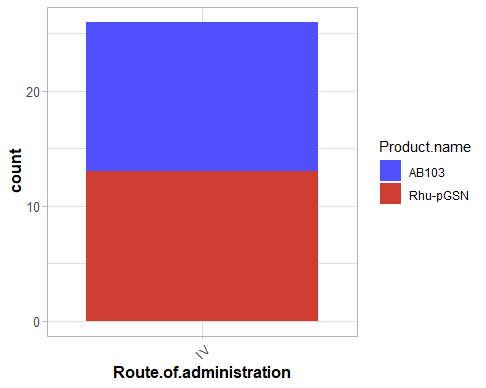

---

.png)

---

### **What is the Names of the Pathogen that immuno-modulating agents tested on ?**

### Result :

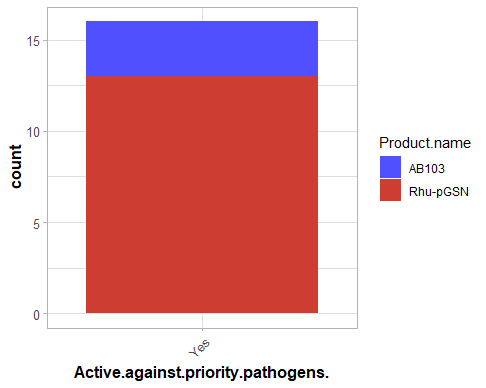

<aside>
💡

so seems Like **Rhu-pGSN** product is very promising against Priority Pathogen  and may be **Recombinant human plasma gelsolin protein**

is very good 

</aside>

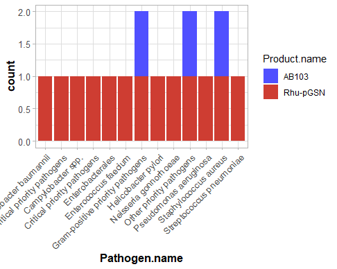

# **Microbe-Modulating**

the numbers of the **Microbe-Modulating type Drug** in the dataset is : 9 **Product**

### **What is the antibacterial class of the Microbe-Modulating Products ?**

- **Live biotherapeutic product**
- **Antibiotic inactivator and protective colon-targeted adsorbent**
- **Antibiotic inactivator**

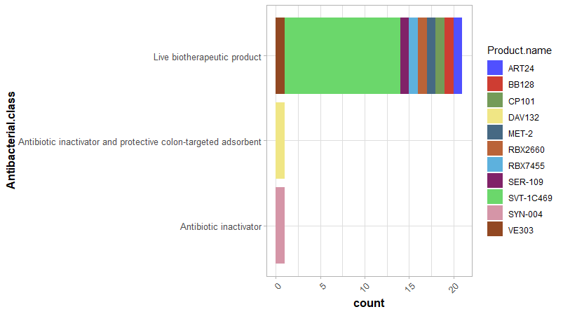

### **the Route of Administration of the different Microbe-Modulating Products ?**


### **What is the Names of the Pathogen that Microbe-Modulating Products tested on ?**

the only pathogen that Products tested on is : ***Clostridioides difficile***

Except SVT-1C469 has been Tested against Multiple Pathogens

### **Results**

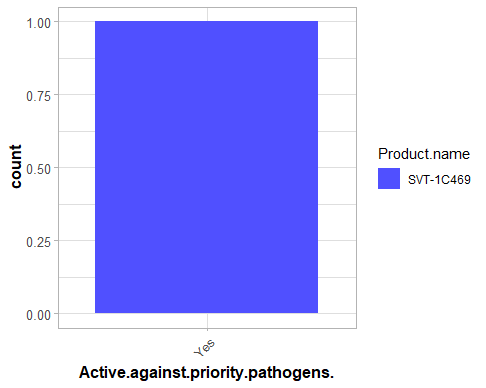

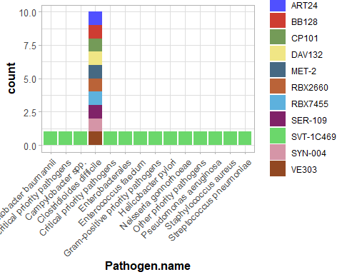

<aside>
💡

Because **The lack of Data** we could not know how Products  effect ***Clostridioides difficile.***

Except that data **SVT-1C469** Product show Promising Potential against **Helicobacter pylori** Pathogens.

</aside>

# **Miscellaneous**

the numbers of the **Miscellaneous type Drug** in the dataset is : 5 **Product**

### **What is the antibacterial class of the Miscellaneous Products ?**

**[1] "Staphyloxanthin biosynthesis inhibition"**

**[2] "Broad spectrum anti-toxin liposomal agent and nanoparticle"
[3] "Type III secretion system inhibition + cefepime"**

**[4] "Undisclosed (FimH)"**

**[5] "Alginate oligosaccharide (G-block) fragment"**

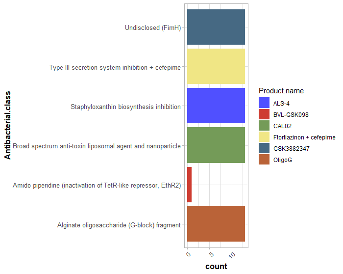

### **the Route of Administration of the different Miscellaneous Products ?**

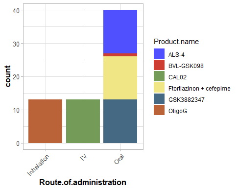

### **What is the Names of the Pathogen that Miscellaneous  Products tested on ?**

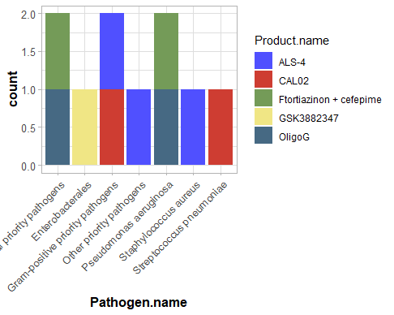

### Result

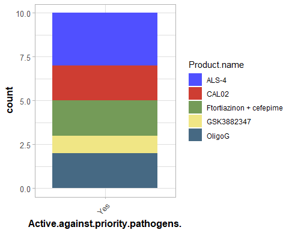

# **antibodies data**

the numbers of the **antibodies  type Drug** in the dataset is : 6 **Product**

### **What is the antibacterial class of the antibodies Products ?**

```
**[1] "Monoclonal antibody"
[2] "anti-S. aureus IgM monoclonal Ab"
[3] "anti-S. aureus IgG monoclonal Ab"
[4] "Monoclonal Ab like\nrecombinant protein"
[5] "Antibody"
[6] "anti-C. difficile polcyclonal Ab"**
```

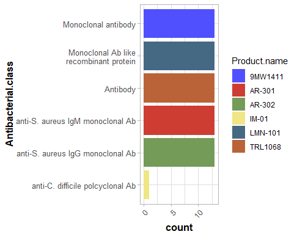

### **the Route of Administration of the different antibodies Products ?**

### **What is the Names of the Pathogen that antibodies  Products tested on ?**


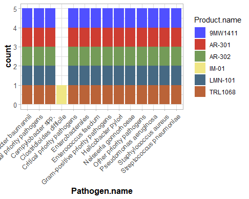

### Result

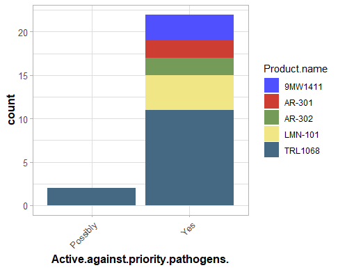

<aside>
💡 It seems very Promising affective against all of the pathogens that had bee tested on  

</aside> 

## Summary The Result

From our analysis and summarize the given data( [here](https://vigorous-dahlia-f5d.notion.site/AMR-New-Products-Deep-Analysis-38b6b444f6224a15a3afd647f7e6c18f) you can find this deep analysis )  
and after comparing between each product category and R.D.Phase.It turns out that the use of unconventional(Non-traditional) products is highly effective, up to 96%, and that taking medications intravenously is always effective.  
You can see this [Infographic](https://drive.google.com/file/d/1xnLhcd_LJfnsJomjtbc3gQtF7GAVvwgg/view?usp=sharing)
